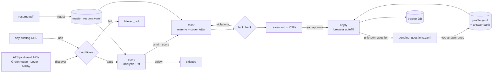
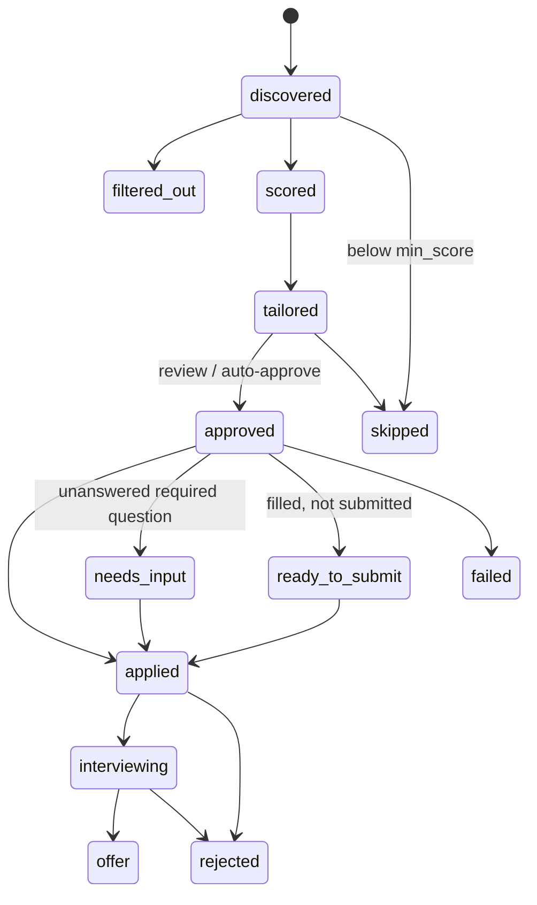

# jobpilot: workflow design

The rough idea: *give it my resume and my details; it finds jobs, adapts the resume
to each posting, and applies.* This document turns that into a pipeline that is
reliable, doesn't embarrass you in front of recruiters, and doesn't get your
accounts banned.

## Principles

1. **One source of truth about you.** Your resume is parsed once into
   `master_resume.yaml`, which you then review and *extend* (add the bullets that
   never fit on one page). Tailoring can only select and reword what's in this file.
2. **Tailor, never fabricate.** Every tailored bullet cites the master bullets it came
   from, and a deterministic checker (not the LLM's promise) verifies numbers,
   skills and keywords against those citations. Fabricated experience is the fastest
   way to fail a technical interview or have an offer rescinded.
3. **Quality over volume.** Spend tokens and applications only on jobs you fit.
   Cheap rule filters first, LLM scoring second, tailoring only above a threshold,
   and daily/per-company caps. Ten tailored applications beat a hundred generic ones.
4. **Never guess on anything legal or personal.** Work authorization, sponsorship,
   attestations, salary and demographics come from your profile or answer bank, or
   the question is queued for you. The LLM only drafts free-text answers, and those
   are always flagged for review.
5. **Humans click Submit (by default).** Autonomy is a dial (`review` → `assisted` →
   `auto`), and `auto` is gated by strict conditions.
6. **Use the front door.** Postings come from the public job-board APIs that
   Greenhouse, Lever and Ashby provide for career pages, not from scraping LinkedIn
   or Indeed (against their terms; accounts get restricted).
7. **Everything is resumable and auditable.** Each stage is idempotent over a SQLite
   state machine, and every status change is logged with a reason.

## Pipeline



### Stage 0: ingest (`jobpilot ingest resume.pdf`)
- Extracts text from PDF/DOCX/TXT and asks Claude to transcribe it into structured
  YAML (roles, projects, bullets, education, skills). It is told not to embellish.
- Each bullet gets a stable id (`e1.b3` = role 1, bullet 3) and skill tags.
- **Your job:** read the YAML, fix parsing mistakes, and add more bullets. This file is
  your long-form career record; the richer it is, the better every tailored version.

### Stage 1: discover (`jobpilot discover`, `jobpilot add <url>`)
- Pulls every posting from the company boards in `settings.yaml`
  (`boards-api.greenhouse.io`, `api.lever.co`, `api.ashbyhq.com`). No login, stable JSON.
- `add <url>` accepts any posting. Greenhouse/Lever/Ashby URLs go through their API;
  anything else is fetched as HTML.
- Dedupe by id *and* by normalized company+title, so a role re-posted on another board
  isn't applied to twice.

### Stage 2: filter (no LLM)
Title must match `title_keywords` and none of `exclude_title_keywords`; location must
match `locations` (or be remote if `remote_ok`); posting age ≤ `max_age_days`.

### Stage 3: score (`jobpilot score`)
One Claude call per job returns:
- **JobAnalysis:** seniority, must-have / nice-to-have skills, ATS keywords, work mode,
  sponsorship stance, salary, red flags.
- **FitAssessment:** 0-100 interview-likelihood score, matched requirements, gaps, rationale.

Your master resume sits in the system prompt with prompt caching, so scoring many jobs
re-reads it at a fraction of the cost. Policy guardrails override the model, e.g.
"no sponsorship" plus "you need sponsorship" scores 0. Jobs ≥ `min_score` move on.

### Stage 4: tailor (`jobpilot tailor`)
Claude produces a `TailoredResume`: headline, summary, selected and reordered bullets
(reworded to lead with outcomes and use the posting's vocabulary *where truthful*),
a relevant skills subset, a 200-320 word cover letter, and notes on what changed.

**Fact check** (`pipeline/grounding.py`), deterministic:

| check | catches |
|---|---|
| citations exist and belong to the same role | moving achievements between jobs |
| every number in a bullet is in its cited bullets | "40%" becoming "60%" |
| no posting keyword unless the cited bullets / your skills contain it | stuffing "Kubernetes" into a bullet about something else |
| every listed skill is in your master resume | skills you don't have |
| every number in the cover letter appears in your resume | invented metrics, years of experience |

On violations: one retry with the violations as feedback, then a mechanical repair
(offending bullets revert to your original wording). Identity, employers, titles and
dates are always rendered from the master file, never from LLM output.

Output per job in `data/applications/<job id>/`:
`First_Last_Resume.pdf`, `First_Last_Cover_Letter.pdf`, `review.md` (fit, changes,
fact-check result, cover letter), plus HTML/JSON intermediates. The template is
single-column real text, which ATS parsers read cleanly.

### Stage 5: review (`jobpilot review`)
For each tailored job: read `review.md`, open the PDFs, then approve or skip. Set
`require_review: false` to auto-approve jobs whose fact check passed.

### Stage 6: apply (`jobpilot apply`)
A generic Playwright filler that works across Greenhouse, Lever, Ashby and plain HTML
forms, verified against live Greenhouse and Ashby application pages:

1. Open the apply URL (click through "Apply" if it lands on the description).
2. Read every visible control and its human label from the DOM: inputs, selects,
   radio groups, checkboxes, file uploads, and react-select style dropdowns (opened
   to read their real options). It skips the invisible validation twins those
   dropdowns keep.
3. Resolve each answer, most trusted source first:
   **files** (resume/cover letter PDFs) → **answer bank** (`profile.yaml answers:`) →
   **profile rules** (name, email, links, address, sponsorship, notice, relocation,
   EEO...) → **Claude draft** (free-text and non-sensitive multiple choice only,
   always flagged `needs_review`).
   Sensitive questions without a profile/bank answer are never guessed.
4. Fill, screenshot (`filled_form.png`), write `fill_report.json`.
5. Depending on mode:
   - `assisted`: browser stays open; you check and submit; the CLI asks whether you did.
   - `auto`: submits only if nothing is missing, nothing was drafted, nothing errored and
     there's no CAPTCHA, then looks for a confirmation message. Otherwise it behaves as assisted.
6. Unanswered required questions go to `data/pending_questions.yaml`. Answer them
   there, copy them into `profile.yaml answers:`, and they're reused on every future
   application. Over a few weeks the bank covers nearly everything.

Limits: `daily_limit`, `per_company_limit` (many companies see every application to
every role and penalize spraying).

### Stage 7: track (`jobpilot status | show | mark`)
SQLite (`data/jobpilot.db`) holds the state machine and an event log:



## What's deliberately not automated

- **LinkedIn Easy Apply / Indeed Apply.** Automating them breaks their terms and gets
  accounts restricted. Use `jobpilot add <url>` for the company's own posting instead,
  which is usually the same job on the company's ATS.
- **CAPTCHAs.** Detected; the job falls back to assisted mode.
- **Account-wall ATSs (Workday, Taleo, iCIMS).** They need an account per company and
  multi-page wizards. The generic filler helps page by page in assisted mode, but
  there's no auto-submit.
- **Legal attestations** (arbitration agreements, "I certify..."). Only answered from
  your own answer bank.

## Cost and models

Default model is `claude-opus-5-5` (configurable in `settings.yaml`), with effort
tuned per stage: `low` for scoring (high volume), `high` for tailoring (quality),
`medium` for drafting answers. Calls use structured outputs (validated Pydantic
objects), prompt caching for your resume, and Anthropic's server-side refusal
fallback, so a classifier false positive (e.g. on a security-engineering posting)
retries on another model instead of failing.

## Code map

```
jobpilot/
  cli.py              commands
  workflow.py         stage orchestration over the tracker
  config.py           settings.yaml, profile.yaml, data dir layout
  models.py           MasterResume, Job, JobAnalysis, FitAssessment, TailoredResume, JobStatus
  llm.py              Claude structured-output wrapper
  db.py               SQLite tracker + dedupe
  sources/            greenhouse, lever, ashby, URL import
  pipeline/
    ingest.py         resume -> master YAML
    filters.py        rule filters
    score.py          analysis + fit + guardrails
    tailor.py         tailoring loop
    grounding.py      fact check + repair
    render.py         HTML/PDF (templates/)
  apply/
    answers.py        answer resolution (bank, profile rules, sensitive-question policy, LLM drafts)
    browser.py        DOM field extraction, filling, submit/confirm
```

## Roadmap

1. **Inbox tracking.** Watch Gmail for confirmations, rejections and interview invites
   and move tracker states automatically (`applied → rejected / interviewing`).
2. **Scheduling.** Run `discover` + `score` daily (cron or a scheduled agent) and send a
   digest of new strong matches.
3. **Job alerts as a source.** Parse LinkedIn/Indeed alert *emails* (allowed: they're
   sent to you) and resolve each to the company's ATS posting.
4. **Learning loop.** Track response rate by score band, resume variant and source;
   use it to tune `min_score` and what tailoring emphasizes.
5. **Follow-ups and interview prep.** Draft a follow-up after N days of silence;
   generate a prep sheet (likely questions, your matching stories) when a job moves to
   `interviewing`.
6. **Workday adapter.** Account creation plus multi-step wizard, assisted mode only.
